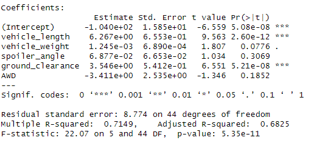
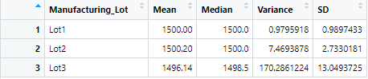
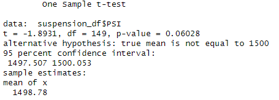
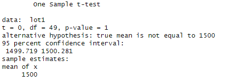
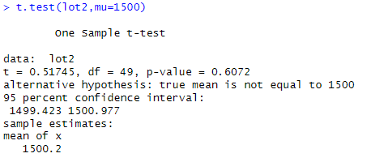
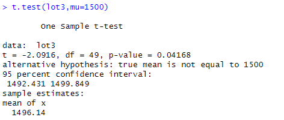

# MechaCar Statistical Analysis

## Linear Regression to Predict MPG

### The following screenshot shows the summary of the statistical values derived from the linear model generated in R.

According to our linear model, the veihicle length and ground clearance both provided non-random amounts of variance to the mpg values in the dataset. This was because their p-values were far below the significance level of 0.05. The intercept also has a p-value below the significance level suggesting there are other variables contributing to MPG that are not accounted for in this dataset.

The slope is not considered to be zero because that would imply that there is no change in the dependent variable (mpg) as you change any of the independent variables.

Finally, this model is a fairly strong predictor of mpg because the multiple r-squared is > 0.7. This suggests a fairly strong correlation between our model and mpg.

## Summary Statistics on Suspension Coils

### The following screenshots show the summary statistics for the PSI data broken down as a total and by manufacturing lot.

The Mecha Car manufacturing specifications dictate that the variance of the suspension coils must not exceed 100 PSI. Based on what we discovered, the total summary of all manufacturing lots meets with specification, however when we break the data down by manufacturing lot we find that Lot 3 has a variance much higher than 100 PSI, which Lots 1 and 2 have a variance much lower. Therefore it appears the Lot 3 is not in compliance with the manufacturing specifications.

## T-Tests on Suspension Coils

### T-test of total data

With a p-value of 0.6208 we can confidently say that the mean of all the PSI data is statistically similar to the population mean of 1500 PSI.

### T-test of Lot 1

With a p-value of 1 we can say that the mean of the PSI data for just manufacturing lot 1 is statistically the same as the population mean of 1500 PSI.

### T-test of Lot 2

With a p-value of .6072 we can say that the mean of the PSI data for just manufacturing lot 2 is statistically similar to the population mean of 1500 PSI.

### T-test of Lot 3

With a p-value of .04168 we can say that the mean of the PSI data for just manufacturing lot 3 is NOT statistically similar to the population mean of 1500 PSI. This is consistent with the analysis done in part 2.

## Study Design: MechaCar vs Competition

One of the most important metrics consumers care about when buying a car is reliability. Car maintenance can present a massive 
